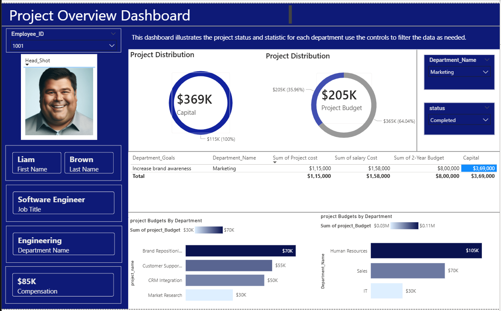

# strategic_project_budget_and_employee_performance_insights
An analytical dashboard or repository focused on optimizing project budgets and evaluating workforce productivity to drive strategic business decisions.

## 🧾 Table of Contents

- 📘 [Project Overview](#project-overview)  
- 🎯 [Objectives](#objectives)  
- 📁 [Dataset](#dataset)  
- 🛠️ [Tools & Technologies](#tools--technologies)  
- 🗂️ [Folder Structure](#folder-structure)  
- 📊 [Data Analysis (SQL)](#data-analysis-sql)  
- 📊 [Power BI Dashboard Overview](#power-bi-dashboard)  
- 🧠 [Key Insights](#key-insights)   
- 📚 [References](#references)
- 👤 [Author & Contact](#author--contact)
---
## 📌 Project Overview

This project focuses on analyzing project budgets and employee performance to identify cost optimization opportunities and productivity trends.  

Using SQL for data analysis and Power BI for visualization, this dashboard provides strategic insights to support better business decision-making.

The goal is to:
- Monitor budget allocation and spending
- Evaluate employee performance metrics
- Identify underperforming projects
- Improve workforce efficiency
---
## 🎯 Objectives

- Analyze project budget vs actual spending
- Measure employee productivity and contribution
- Identify high-cost and low-performance areas
- Support strategic decision-making with data-driven insights
---
## 📂 Dataset

The dataset includes:

- Project Details (Project ID, Budget, Deadline)
- Employee Information (Department, Role, Performance Score)
- Budget Allocation & Actual Expenses
- Productivity Metrics
- Data was imported into SQL Server for cleaning and transformation.
---
## 🛠 Tools & Technologies


---
## 📁 Folder Structure

```
strategic_project_budget_and_employee_performance_insights/
│
├── data/
│   ├── raw_data.csv
│   └── cleaned_data.csv
│
├── sql/
│   ├── database_creation.sql
│   ├── data_cleaning_queries.sql
│   └── analysis_queries.sql
│
├── powerbi/
│   └── strategic_dashboard.pbix
│
├── images/
│   └── dashboard_preview.png
│
└── README.md
```
---
## 📊 Data Analysis (SQL)

Performed the following analysis using SQL:

- Budget vs Actual Cost Comparison
- Employee Performance Ranking
- Department-wise Productivity Analysis
- Cost Overrun Identification
- Aggregate Metrics using GROUP BY and JOIN

Key SQL concepts used:
- SELECT, WHERE
- JOIN
- GROUP BY
- CASE Statements
- Aggregate Functions
---
## 📈 Power BI Dashboard Overview

The Project Overview Dashboard provides a comprehensive analysis of project budgets and employee performance across departments.

This interactive dashboard allows users to filter data by Employee ID, Department Name, and Project Status to gain detailed insights.

### 🔍 Key Dashboard Components

🔹 Employee Profile Panel  
Displays employee details including:
- Employee ID  
- Headshot  
- First & Last Name  
- Job Title  
- Department  
- Compensation  

🔹 Capital & Budget Overview  
- Total Capital: $369K  
- Project Budget Allocation: $205K  
- Visual donut charts highlight budget distribution and allocation percentages.

🔹 Department Goals & Financial Summary  
A detailed table showing:
- Department goals  
- Project cost  
- Salary cost  
- 2-Year Budget  
- Capital allocation  

🔹 Project Budgets by Department  
Bar charts visualize:
- Budget allocation across projects  
- Department-wise spending comparison  
- Highest budget utilization areas  

### 🎯 Business Value

This dashboard helps management to:
- Monitor project budget allocation
- Compare planned vs actual spending
- Identify high-investment departments
- Evaluate employee-level financial impact
- Support strategic budgeting decisions
## 📸 Dashboard Preview



---
## 💡 Key Insights

- Total Capital allocation stands at $369K, indicating strong investment in strategic initiatives.

- The Project Budget accounts for $205K, representing a significant portion of overall capital distribution.

- Marketing department shows high budget utilization aligned with brand awareness initiatives.

- Salary cost ($1.58M) exceeds direct project cost ($115K), highlighting workforce investment as a major expense component.

- Human Resources department holds the highest project budget allocation compared to IT and Sales.

- Certain projects demonstrate high budget allocation but comparatively lower performance output, indicating potential efficiency gaps.

- Capital distribution suggests that a small number of projects consume a large percentage of the overall budget.

- Department-level filtering reveals variation in spending patterns based on project status (Completed vs Ongoing).

- Budget concentration in selected departments indicates strategic prioritization of business functions.

- Employee-level analysis enables performance-based financial accountability.

- Cost structure analysis indicates salary expenses form the largest share of total expenditure.

- Budget variance across departments suggests opportunity for cost optimization.

- Cross-department comparison reveals uneven distribution of capital resources.

- Data-driven filtering supports scenario-based decision making.

- The dashboard enables early detection of cost overruns and performance inefficiencies.


---
## 👤 Author & Contact

**Gajanan M Naik**  
Aspiring Data Analyst  

  - 📧 Email: [naikgajanan238@gmail.com](mailto:naikgajanan238@gmail.com)
  - 💼 LinkedIn:[https://www.linkedin.com/in/gajanan-naik-4a8a08373/](https://www.linkedin.com/in/gajanan-naik-4a8a08373/)
  - 🐙 GitHub: [https://github.com/Gajanannaik007](https://github.com/Gajanannaik007)


---
